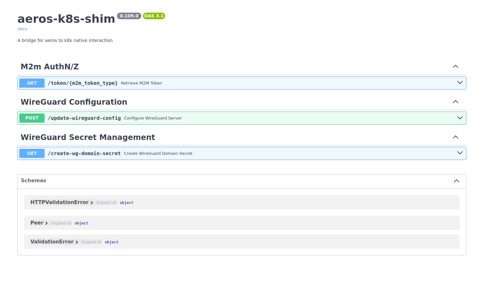

# aeriOS K8s shim
Component to intermediate for accessing K8s environment.

## Description
This component exposes an, expandable, API which receives requests for accompishing K8s related tasks.
K8s secrets, configmpas, pods and other objects are abstracted.
For this reason a service account, a role and an appropriate role binding ensure controlled access to K8s APIs.
At the moment APIs offers:
* M2m tokens, acquired from Etrypoint domain Keycklock
* Wireguard network component re-configuration for network overlays implementation
* Creates Private and Public key for aeriOS domain.
    * Private key and public keys are pushed in a K8s secret
    * Public key is pushed in aeriOS continuum domain entity in "publicKey" attribute.
On init it sets K8s context and creates domain keys, then API is taking over.

## Visuals
  

## Usage
For development, 
   * git clone
   * cd aerios-k8s-shim
   * python3 -m venv venv
   * pip install -r requirments
   * source venv/bin/activate
   * Set DEV value in app_config.py to True
   * Update values in app_config.py for DEV_CTX_PATH and DEV_CTX_NAME to actual local context file and dev context name
   * Run app: "uvicorn main:_app --host 0.0.0.0 --port 8000 --reload"
   * test APIs using the FastAPI swagger page or using curl:   
   * or test APIs using curl, eg:
        * curl  http://localhost:8000/token/cb
    Before bulding images for prod K8s deployment remember to provide fasle value for "DEV" environment variable.


## Installation
For deploying in aeriOS domain.Easier when using Makefile. 
Edit variables, if needed, and :

* Build and tag docker image
```
 make build
```
* Push to aeriOS repository
```
 make push
```
* Package and upload helm chart
```
 make helm-upload
```
* Deploy against cluster chosen as current k8s context
```
 make deploy
```
* All the above
```
 make all
```
* Removes docker image
```
 make clean-build
```
* Removes the helm deployment from the cluster
```
 make clean-deploy 
```
* Removes all the above
```
 make clean-all 
```
## Support
Please use Mattermost T3.3 channel

## License
Copyright 2023.

Licensed under the Apache License, Version 2.0 (the "License"); you may not use this file except in compliance with the License. You may obtain a copy of the License at

    http://www.apache.org/licenses/LICENSE-2.0

Unless required by applicable law or agreed to in writing, software distributed under the License is distributed on an "AS IS" BASIS, WITHOUT WARRANTIES OR CONDITIONS OF ANY KIND, either express or implied. See the License for the specific language governing permissions and limitations under the License.

## Roadmap
Integrate full Tosca to NGSI-LD translation.

## Contributing
Please check Usage and Installation sections above. It contains all information needed for developing and contributing.

## Authors and acknowledgment
Vasilis Pitsilis, Andreas Sakelaropoulos, aeriOS team

## Project status
Supported and Ongoing.

## Add your files

- [ ] [Create](https://docs.gitlab.com/ee/user/project/repository/web_editor.html#create-a-file) or [upload](https://docs.gitlab.com/ee/user/project/repository/web_editor.html#upload-a-file) files
- [ ] [Add files using the command line](https://docs.gitlab.com/ee/gitlab-basics/add-file.html#add-a-file-using-the-command-line) or push an existing Git repository with the following command:

```
cd existing_repo
git remote add origin https://gitlab.aerios-project.eu/wp3/t3.3/hlo-local-allocation-manager.git
git branch -M main
git push -uf origin main
```


